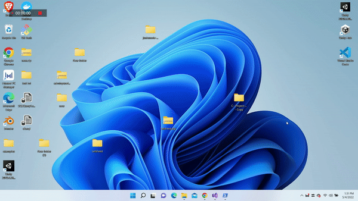
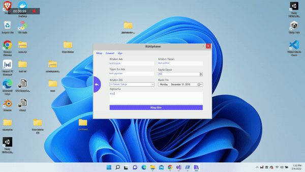

# c_sharp_project_by_step
> ## uygulamaninn calisma aninin gorunumu

- ilk olarak db_query klasoru icresindeki dosyayi mssql severinza codlari ekleyip clistiriniz 
- ikici ama olarak navbardaki project butonuna tiklayip **add new data source** next te tikladiktan sonra ekran gelen ilk kisima  server adinizi server name adinizi sql serverden kopyalayarak yapistiriniz sonrada veri tabani adinizi seciniz connection string kopyaladiktan sonra bu kodu **app.config** dosyasi icerinde **connectionStrings** adli tagin icindeki add kismindaki  **connectionString** kisdaki **"...."** icindeki yaziyi silerek kedi veritabini connectionString ekleyerek 
- programi yeiden calistirin
- yeniden calistirmassainiz hata verecektir!
